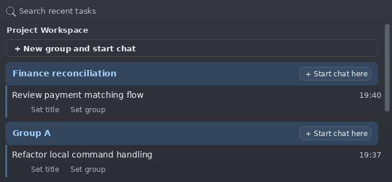

# Codex Local Groups (English)

<p align="center">
  <a href="README.md">简体中文</a> | <strong>English</strong>
</p>

<p align="center">
  
  
  
  
</p>

Codex Local Groups is an independent VSCode extension that adds local conversation titles, requirement groups, and project isolation to the OpenAI Codex VSCode extension. It discovers the installed Codex extension, applies conservative patches, and backs up target files before writing.

## Preview

<p align="center">
  
</p>

## Features

- Local conversation title aliases.
- “Project > Requirement Group > Conversation” view.
- Local conversation isolation by current project.
- In the top recent-task list, each local conversation has same-row `设置标题 / 设置分组` actions on the right, saved through the VSCode input box while using less vertical space.
- `+ New group and start chat` under each project.
- `+ Start chat in this group` on group headers.
- `Check Status` checks the Codex extension, patch status, metadata, and conversation counts, with Apply / Reload shortcuts.
- `Search Conversations` uses VSCode QuickPick to search local titles, groups, project paths, or conversation IDs, then opens the selected Codex conversation.
- `Manage Groups` uses VSCode QuickPick to rename, merge, clear groups, and view conversations in a group.
- For API-key auth, disables Codex ChatGPT `/wham/usage*`, remote plugin/OAuth prechecks, and Statsig/AB requests to reduce 401/432 retries and loading stalls.
- Migration from:
  - Old: `~/.codex/codex-vscode-conversation-titles.json`
  - New: `~/.codex/codex-vscode-conversation-meta.json`
- To avoid startup-time blank views, Codex Local Groups only performs a read-only bundle check during VSCode startup. If an upgrade replaced compatible patches, it offers one-click repair and Reload.
- Repair can restore clean bundles before patching if the Codex UI gets stuck.
- Restore Original Codex UI can restore clean bundles without reapplying patches when you want to stop using the enhancements.

## API-key mode request blocking

v0.0.14+ is optimized for API-key auth and blocks or disables these ChatGPT-auth-only requests / capabilities:

- `/wham/usage*`: ChatGPT subscription and usage requests return `null` when either a path or a full URL matches.
- `/ces/v1/rgstr*` and `/backend-api/plugins/featured*`: API-key-mode telemetry/plugin prechecks return `null`.
- `account-info`: no longer extracts ChatGPT account id, user id, or plan from auth tokens.
- `remote plugin bundle sync`: `app-server` starts with `--disable plugins`, disabling remote plugin sync.
- `failed to read OAuth tokens from keyring`: `app-server` starts with `-c mcp_oauth_credentials_store="file"` to avoid keyring OAuth prechecks.
- `https://ab.chatgpt.com/v1/initialize`: the webview Statsig/AB SDK uses `preventAllNetworkTraffic:!0`.

If you use ChatGPT auth/OAuth and depend on ChatGPT subscription usage pages, remote plugin marketplace, OpenAI-curated plugins, or AB experiments, do not apply the v0.0.14+ API-key fallback patch.

## Installation

### Option 1: Install from source

```bash
git clone https://github.com/xionghaizhi/vscode-codex-groups.git
cd vscode-codex-groups
```

Copy the extension directory into a VSCode extensions directory. A versioned directory name is recommended:

```bash
cp -r . ~/.vscode/extensions/vscode-codex-groups-0.0.29
```

For Remote VSCode Server, copy it into the remote extensions directory, for example:

```bash
cp -r . ~/.vscode-server/extensions/vscode-codex-groups-0.0.29
```

Then in VSCode:

1. Run `Developer: Reload Window`.
2. Choose `修复并 Reload` in the startup notice. If no notice appears, run `Codex Local Groups: Apply Patches`, then Reload Window.

### Option 2: Install a VSIX

You can download the packaged VSIX from GitHub Actions:

1. Open the repository `Actions` page.
2. Select the `Package VSIX` workflow.
3. Open the latest successful run and download the `vscode-codex-groups-vsix` artifact.
4. Unzip it to get the `.vsix` file. When a `v*` tag is pushed, the same VSIX is also uploaded to GitHub Release assets.

Maintainers can also package locally:

```bash
cd vscode-codex-groups
npx @vscode/vsce package
```

Install the downloaded or packaged VSIX:

```bash
code --install-extension vscode-codex-groups-0.0.29.vsix
```

For Remote VSCode Server, install it in the remote window and make sure it runs on the remote/workspace side.

## Usage

### First run

1. Make sure the OpenAI Codex VSCode extension is installed.
2. Install this extension.
3. Reload Window, then choose `修复并 Reload` in the startup notice.
4. If no notice appears, run `Codex Local Groups: Apply Patches`, then Reload Window.

### Set local title / requirement group

1. Open the Codex recent conversations list.
2. Find a local conversation row.
3. Click the same-row `设置标题` / Set Title or `设置分组` / Set Group action on the right.
4. Enter the value in the VSCode input box.
5. The current Codex webview is updated after saving. If it is still running an old patch, reload the window once.

This also creates a group: enter a group name that does not exist, and the current conversation will move into that new group.

### Create a new group and start a chat

1. Find the target project in the recent list.
2. Click `+ 新建分组并开始会话` / `+ New group and start chat`.
3. Enter the new group name.
4. Codex opens a new conversation and assigns it to the new group when identifiable.

### Start a conversation in a group

1. Find the project and requirement group in the recent list.
2. Click `+ 在此分组新建会话` / `+ Start chat in this group` on the group header.
3. A new conversation opens and will be assigned to the group when identifiable.

### Open metadata

Run:

```text
Codex Local Groups: Open Metadata JSON
```

The metadata file is stored in the Codex user directory by default:

```text
~/.codex/codex-vscode-conversation-meta.json
```

### Reset pending group

If the `+` flow does not assign the new conversation correctly:

```text
Codex Local Groups: Reset Pending Group
```

If the current webview still does not sync, reload the window once.

### Check status

Run:

```text
Codex Local Groups: Check Status
```

Status details are written to the `Codex Local Groups` output channel. The message also offers `Apply Patches`, `Reload Window`, and `Show Output` actions.

### Search conversations

Run:

```text
Codex Local Groups: Search Conversations
```

Search by local title, group, project path, or conversation ID. Selecting a result opens the local conversation through a Codex deeplink.

### Manage groups

Run:

```text
Codex Local Groups: Manage Groups
```

The list shows group name, conversation count, and project path, and it supports searching by group or project path. After selecting a group, you can:

- Rename the group and update all conversations in it; if the new name already exists, the command asks for merge confirmation first, and groups with unknown project paths cannot be merged.
- Merge it into another group in the same project only, with a second confirmation after choosing the target; groups with unknown project paths cannot be merged.
- Clear the group and move conversations to Ungrouped, with confirmation; this only removes the group label and does not delete conversations.
- View conversations in the group and open a selected conversation; view is read-only.

Batch updates only write local metadata and do not rewrite Codex bundles while the UI is running. Reload Window if the current UI is stale; use `Apply Patches` only after a Codex extension upgrade or when patches are missing.

## After Codex extension upgrades

The Codex extension upgrade may overwrite patched bundles. Run:

```text
Codex Local Groups: Apply Patches
Codex Local Groups: Reload Window
```

Terminal verification:

```bash
cd ~/.vscode-server/extensions/vscode-codex-groups-0.0.29
npm run plan-patches
npm run apply-patches
npm run repair-codex-ui
npm run restore-codex-ui
npm run verify-patched-bundles
```

## Safety and backups

- Target files are backed up before patching.
- Backups are written under the target Codex extension directory:

```text
<openai.chatgpt-extension>/.codex-patches/
```

- Conservative matching: if anchors do not match, patching stops.
- Syntax checks and idempotence checks run after patching.

## Command palette features

Type `Codex Local Groups` in the VSCode command palette to see the extension commands:

| Command | When to use it | What it does |
| --- | --- | --- |
| `Codex Local Groups: Manage Groups` | When groups are duplicated, too many, or need batch cleanup | Opens the group management center. You can search by group or project path, see conversation counts, rename groups, merge groups, clear groups, or view conversations in a group. Merge and clear actions require confirmation and only update local metadata; conversations are not deleted. |
| `Codex Local Groups: Check Status` | When you are not sure whether the extension is active, or after a Codex upgrade | Checks the OpenAI Codex extension location, version, patch status, metadata path, total conversations, grouped count, and ungrouped count. Results are written to the `Codex Local Groups` output channel, with Apply / Reload / Show Output shortcuts. |
| `Codex Local Groups: Apply Patches` | When the grouped UI disappears after a Codex upgrade, or when a command asks you to reapply patches | Manually patches the OpenAI Codex extension bundles with this extension's enhancements. Target files are backed up first; unsupported bundle anchors stop the patch instead of overwriting blindly. Reload Window is usually needed afterward. |
| `Codex Local Groups: Repair Codex UI` | When Codex UI is stuck, blank, or patch state looks broken after an upgrade | Restores clean Codex bundles from `.codex-patches`, then reapplies patches. Reload Window is usually needed afterward. |
| `Codex Local Groups: Restore Original Codex UI` | When disabling this extension, or Codex is still broken after disabling it | Restores clean Codex bundles from `.codex-patches` without reapplying patches. Reload Window is needed afterward. |
| `Codex Local Groups: Open Metadata JSON` | When you need to inspect or manually troubleshoot local titles and group data | Opens `~/.codex/codex-vscode-conversation-meta.json`, which stores local titles, groups, project paths, and pending group state. Back it up before manual edits. |
| `Codex Local Groups: Reload Window` | After patching, installing a new version, or when the current Codex webview still shows old UI | Runs VSCode `workbench.action.reloadWindow` so the extension host and Codex webview load the latest patches. |
| `Codex Local Groups: Reset Pending Group` | When `+ New group and start chat` does not assign the new conversation correctly, or pending state is stuck | Only clears `pendingGroup` in local metadata, does not rewrite Codex bundles, and prompts Reload Window. It does not delete existing conversations or groups. |
| `Codex Local Groups: Search Conversations` | When you need to quickly find a local Codex conversation | Uses QuickPick to search local titles, groups, project paths, or conversation IDs. Selecting an item opens the local conversation through a Codex deeplink. |

## Troubleshooting

- Group UI is missing: run `Apply Patches`, then Reload Window.
- Broken after a Codex upgrade: startup detection offers one-click repair and Reload. You can also run `Apply Patches`, then Reload Window.
- Codex UI is stuck or blank: run `Codex Local Groups: Repair Codex UI`, or run `npm run repair-codex-ui` in a terminal, then Reload Window.
- Codex is still broken after disabling/uninstalling this extension: run `Codex Local Groups: Restore Original Codex UI`, or run `npm run restore-codex-ui`, then Reload Window. Disabling the extension does not automatically revert patched Codex bundles.
- API-key auth keeps logging `/wham/usage`, `/ces/v1/rgstr`, remote plugin sync, keyring OAuth, or `ab.chatgpt.com/v1/initialize`: run `Apply Patches` or `Repair Codex UI`, then Reload Window.
- Patch failed: check the `Codex Local Groups` output channel.
- Node version is too old: the extension prefers the VSCode Server Node; set `codexLocalGroups.nodePath` if needed.
